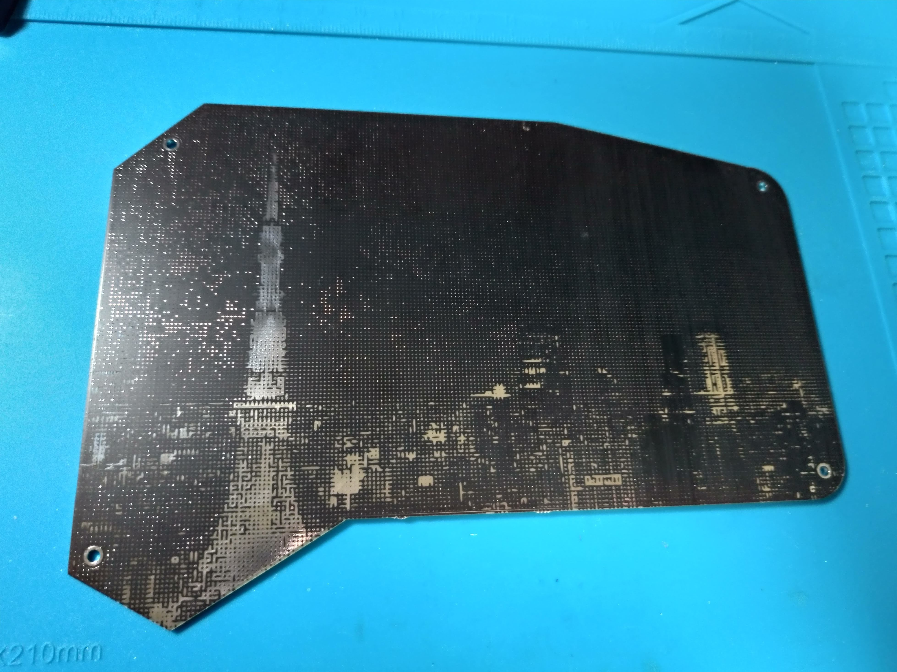
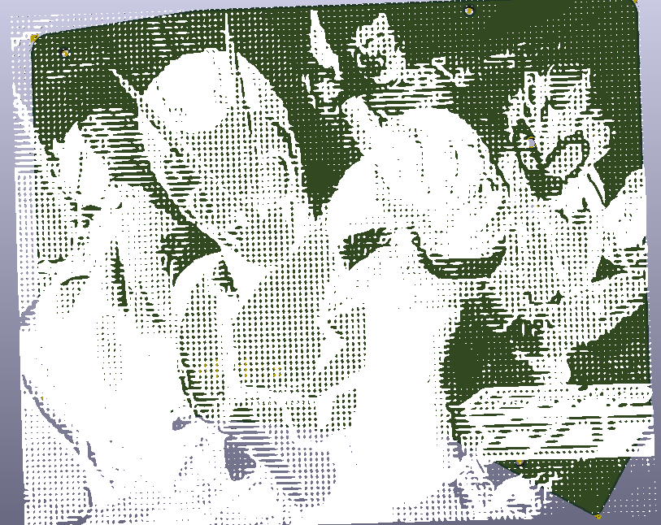

## 写真基板の作り方

Presented by 魔王

>>>

### example

>>>

# 題材

>>>

# 閑話

---

# 仮面ライダーゼロワンについて

---

### Story

舞台は人工知能搭載型人型ロボット「ヒューマギア」が社会で活躍する時代。

ヒューマギアを製造する飛電インテリジェンスの二代目社長・飛電或人と、
ヒューマギアを暴走させ怪人マギアとして操るサイバーテロリスト・滅亡迅雷.netとの闘いを描く。  

---

# 登場人物紹介

---

## 飛電或人

主人公。AIに育てられる。  
祖父が飛電インテリジェンスの創業者。

変身アイテムはなんと「キーボード」！！

---

## イズ

社長秘書。  
感情のないロボットのハズだが徐々に…

---

## 刃 唯阿（やいば ゆあ）

対人工知能特務機関A.I.M.S.の技術顧問兼特殊技術研究所最高責任者。  
運動神経抜群、頭脳明晰、そしてなんといっても容姿端麗！

合理主義で冷静沈着な正確だが、部下の怪我を負った際には取り乱すシーンもあり、情に熱い一面も‥！

敵それとも味方か…！？

> レギュラーの女性仮面ライダーはシリーズ初！！

>>>

## ダブルヒロイン

イズ、やいばさん、どちらが好みか意見が分かれるが…

---

### わたしはやいばさんがタイプです

>>>

# ・・・

>>>

それでは気を取り直して

## 写真基板の作り方

---

### 1.任意の画像をGIMPに取り込む

---

### 2.実際の基板に合わせて拡大・縮小・トリミング

---

### 3.明るさコントラストを調整し白黒にする

---

### 4.新聞印刷を適用する

パラメータ重要。  
(なぜか)時間が押しているのでまたの機会に説明します。

---

### 5.Kicadに取り込む

>>>

## 完成イメージ

>>>

### 以上、「やいばさんの魅力について」でした！

ご清聴ありがとうございました。

https://swanmatch.github.io/bounenkey2019/
